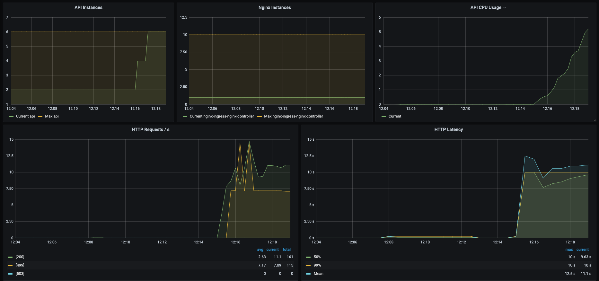

# Bench the API

Now that the API is deployed let's bench it

Requirements:
 - wrk
 

Run the bench

```
wrk -t18 -c400 -d30s http://api.hf-bench.DOMAIN/predict -s post.lua --timeout 60
```

Adapt the nb of thread and connection with your hardware.

# First experiment

Purpose is to warm up the autoscaler to check if it's works:



As we can see, the autoscaler seems to scale automatically and fast to the limit (6).

```
wrk -t18 -c400 -d60s http://api.hf-bench.DOMAIN/predict -s post.lua --timeout 60
Running 30s test @ http://api.hf-bench.DOMAIN/predict
  18 threads and 400 connections
  Thread Stats   Avg      Stdev     Max   +/- Stdev
    Latency    12.82s     6.42s   27.00s    70.12%
    Req/Sec     4.00      4.30    30.00     77.82%
  599 requests in 30.06s, 151.50KB read
Requests/sec:     19.92
Transfer/sec:      5.04KB
```

Seems like we still have a lot of timeout (represented as 499 in the Dashboard)
Some solutions:
- increase nginx timeout
- implement microbatch
- tweek some resources

# Second experiment

BentoML have a micro batch feature let's try it.

Seems like the MultiProcessingDataLoaderIter does work well with gunicorn 
```
AssertionError: daemonic processes are not allowed to have children
```
Seems like, BentoML will move from gunicorn, so for now no microbatch
https://github.com/bentoml/BentoML/pull/1773


