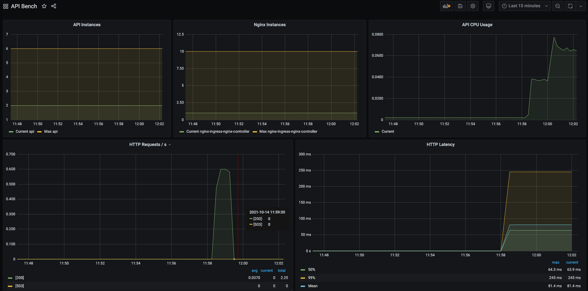

# Bench Infrastructure

This terraform code will spawn on OVHcloud:

- one kubernetes cluster
- 2 nodes pools:
  - control-plane node pool for nginx / monitoring workload
  - data-plane for the hf api

Requirement:
- OVHcloud account 
- OVHcloud Public cloud tenant
- OVHcloud Domain

# Deploy

```
cp terraform.tfvars.template terraform.tfvars
// Fill values according to requirements
tf init 
tf apply
```

# Check that the infra works

You can visit:
- grafana.hf-bench.DOMAIN
- prometheus.hf-bench.DOMAIN

# API

You can check that the API is deployed
```
curl api.hf-bench.<domain>/predict -d '{"text": "At least someone answer here"}'
[{"label": "POSITIVE", "score": 0.9365665316581726}]
```

You can also visit grafana to display some stats about the API




# Caveat / TODO

- SSL is not handled
- vRack is not set-up
- prometheus / grafana ui should be on another nginx with some iptables
- secrets should be stored in vault
- install log collection (fluentbit/fluentd)